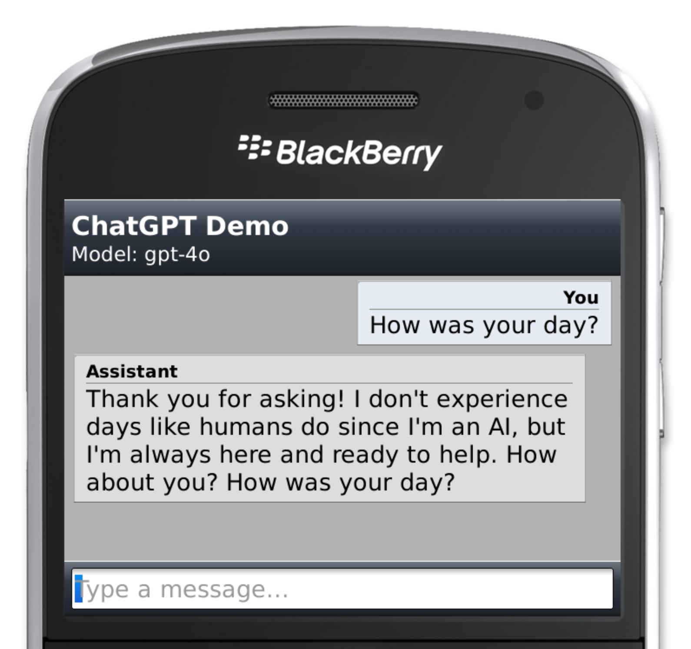

# ChatGPT Demo App for Blackberry OS 7

## Screenshot

## Installation

### OTA

- Open this [link](http://bbchatgpt.slashblade.top/) in Blackberry OS browser.
- Click on the link to install the app.

### Compile from source

- Download the source code from release page.
- Open the project in Blackberry Java Plug-in and connect your Blackberry device.
- Compile the project and click on "load package on the device" button.

## Usage

- Open the app and go to the settings page, enter your instance URL and API key.
    - Now official ChatGPT API is not available due to TLS 1.3 support issue, so you need to temporarily use a proxy or self-hosted API.
- Click on the "Save" button to save the settings.
- Go back to the main page and create a new chat.

## Development

This app is still under development. I am open to any contributions, feel free to open an issue or a pull request. If you want to contribute, please make sure you have the prerequisites installed:

- JDK 1.6.0 update 45
- Blackberry Java Plug-in with Blackberry JRE 7.1.0
